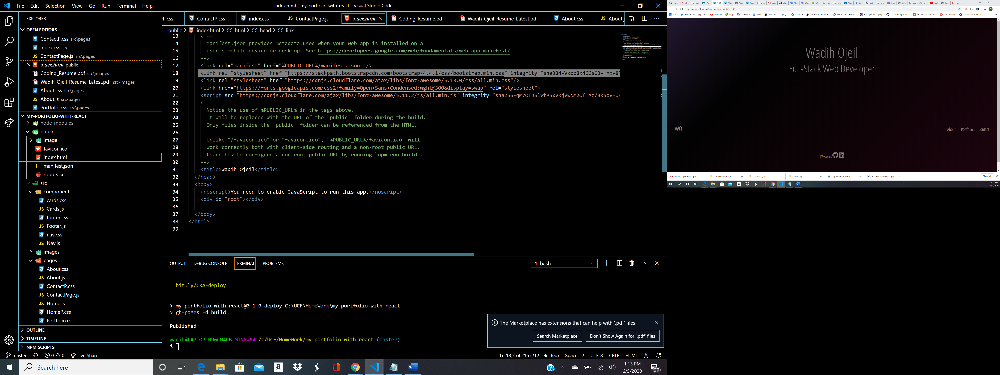

# My React Portfolio

Project Title
My React Portfolio 
Get to know me and check out my online react-portfolio. I have listed some of my work from the time I started off my journey in web development  up until present. I hope you enjoy the live demos that I posted in my portfolio page. Contact me via information posted in my contact page.

Getting Started
The application is running live through github.

Prerequisites
run npm i

Deployment
GitHUb

Try Me Live
<a href="https://wojeil.github.io/my-portfolio-with-react">https://wojeil.github.io/my-portfolio-with-react</a>

Built With
React
Bootsrap

Author

Wadih Ojeil- FullStack Web Developer

License
This project is licensed under the MIT License
 

## Purpose and Inspiration
To give a decent knowledge and my work and who I am.

## Structure
This project is structured in REACT. 

## Tech Stack
+ [REACT](https://reactjs.org/)

#### Install and run
Install all the dependencies with NPM
` install`  
Then start the project
`npm start`

